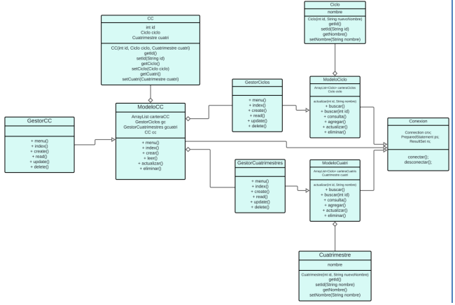
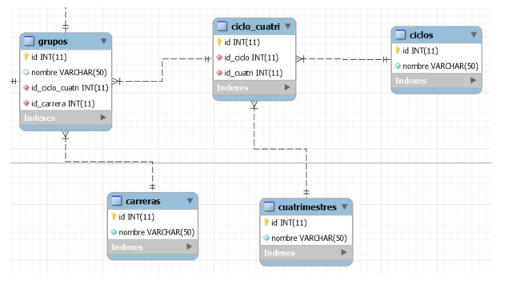

# PROYECTO FINAL: GESTOR DE BASE DE DATOS DE UNA ESCUELA

Para este proyecto, se nos pidió usar el paradigma de programación POO y junto con una conexion a base de datos de los registro de los alumnos.

Para ello tenemos los diagramas de clases y Entidad-Relación que estan en TEAMS

## Primera fase:

En este caso, tenemos que hacer las clases o sus equivalentes:

- Cuatrimestre
- ModeloCuatri
- GestorCuatri

En base al código que proporcionó el profe sobre las clase Ciclos, ModeloCiclo y GestorCiclo.

- Además de modificar o crear otras clases existentes, como son el CC (Ciclo_Cuatri), ModelorCC y GestorCC. Ver las siguientes imagenes o ir a Teams:

